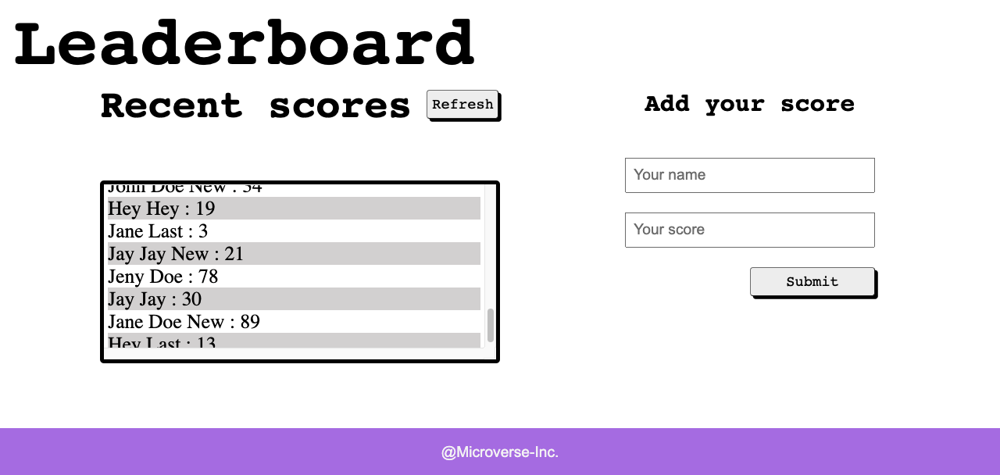

# Leaderboard Project / 

> The leaderboard website displays scores submitted by different players. It also allows you to submit your score. All data is preserved from the external Leaderboard API service.



## Built With

- Javascript
- EcmaScript 6
- Webpack
- Leaderboard API
- REST API

## Live Demo

[Live Demo Link]()

## Getting Started

To get a local copy up and running follow these simple example steps.

#### Clone this repository

```
$ git clone git@github.com:yigitm/leaderboard.git
$ cd leaderboard
```

### Install

```
$ npm install
$ npm start
```

## Authors

👤 **Yigit Mersin**

- Github: [@yigitm](https://github.com/yigitm)
- Twitter: [@yigitmersin](https://twitter.com/ygtmrsn)
- Linkedin: [ygtmrsn](https://www.linkedin.com/in/yigitmersin)

## 🤝 Contributing

Contributions, issues, and feature requests are welcome!

Feel free to check the [issues page](https://github.com/yigitm/leaderboard/issues).

## Show your support

Give a ⭐️ if you like this project!

## Acknowledgments

- Hat tip to Microverse
- Leaderboard API service
- Open source

## 📝 License

This project is [MIT](./MIT.md) licensed.
